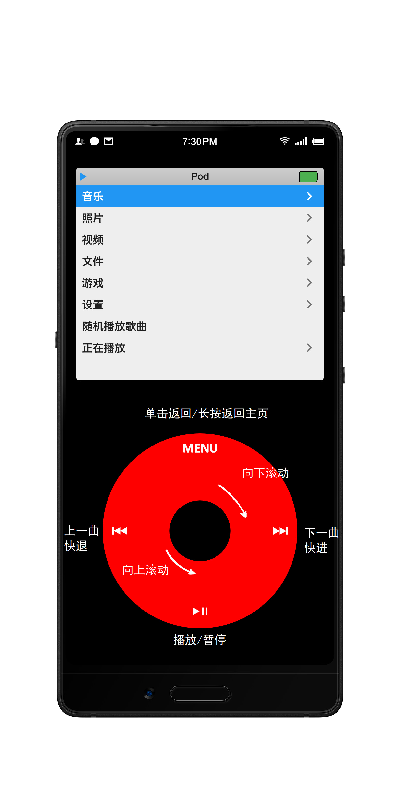

    一款本地音乐播放器test

    模拟iPod Classic操作

    click wheel 滑动红色部分上下移动光标 

    黑色中键确认 

    长按中键可收藏歌曲/含有歌曲的文件夹/专辑/歌手，可在收藏中播放

    四个图标功能如图

     

    项目地址

    <a href="https://github.com/0x1317bf7/PodClassic">PodClassic</a> 

     

    下载地址

    <a href="https://www.coolapk.com/apk/270206">Pod Classic</a> 

     

    另有可作为桌面的launcher版本

    <a href=https://github.com/0x1317bf7/PodClassic/releases/download/1.5/PodClassic_1.5_launcher.apk>launcher.apk</a>

     

    1.5版本更新:

    &nbsp;&nbsp;&nbsp;&nbsp;[最后一次更新]

    &nbsp;&nbsp;&nbsp;&nbsp;支持多语言(简体中文/繁体中文/英文) 

    &nbsp;&nbsp;&nbsp;&nbsp;添加白色主题 

    &nbsp;&nbsp;&nbsp;&nbsp;删除横屏模式 

    &nbsp;&nbsp;&nbsp;&nbsp;大量性能优化

     

    1.4版本更新:

    &nbsp;&nbsp;&nbsp;&nbsp;将横屏改为跟随系统

     

    1.3.3版本更新:

    &nbsp;&nbsp;&nbsp;&nbsp;优化动画和布局，适配更多屏幕尺寸

    &nbsp;&nbsp;&nbsp;&nbsp;图标添加渐变效果

    &nbsp;&nbsp;&nbsp;&nbsp;在播放界面单击中键可选择进度

    &nbsp;&nbsp;&nbsp;&nbsp;无论系统中是否开启振动，现在都可以振动

    &nbsp;&nbsp;&nbsp;&nbsp;歌曲按照碟号排序

    &nbsp;&nbsp;&nbsp;&nbsp;优化了一些其他逻辑

    &nbsp;&nbsp;&nbsp;&nbsp;修复bug

     

    1.3.2版本更新:

    &nbsp;&nbsp;&nbsp;&nbsp;添加了桌面小组件和快捷方式

    &nbsp;&nbsp;&nbsp;&nbsp;更改部分界面的说明

    &nbsp;&nbsp;&nbsp;&nbsp;修复大量bug

     

    1.3.1版本更新:

    &nbsp;&nbsp;&nbsp;&nbsp;注意！更新此版本需要卸载旧版本

    &nbsp;&nbsp;&nbsp;&nbsp;优化CoverFlow

    &nbsp;&nbsp;&nbsp;&nbsp;添加了几个小功能

    &nbsp;&nbsp;&nbsp;&nbsp;优化运行效率,修复bugs

     

    1.3版本更新:

    &nbsp;&nbsp;&nbsp;&nbsp;加入CoverFlow(一个不太成熟的版本,需在设置中开启)

    &nbsp;&nbsp;&nbsp;&nbsp;调整振动强度

    &nbsp;&nbsp;&nbsp;&nbsp;改变排序方式为中文和英文分开排序

    &nbsp;&nbsp;&nbsp;&nbsp;修复bugs

     

    1.2.2版本更新:

    &nbsp; &nbsp; 加入真正的&quot;按键音&quot;

    &nbsp; &nbsp; 更新了一些细节

     

    1.2.1版本更新:

    &nbsp; &nbsp; 适配低分屏

    &nbsp; &nbsp; 修复bug

     

    1.2版本更新:

    &nbsp; &nbsp; 更换图标

    &nbsp; &nbsp; 隐藏系统状态栏

    &nbsp; &nbsp; 快速滑动显示索引

    &nbsp; &nbsp; 添加均衡器(仅支持系统预设)

    &nbsp; &nbsp; 添加夜间模式

    &nbsp; &nbsp; 支持显示flac内嵌歌词

    &nbsp; &nbsp; 修复bug

     

    1.1版本更新:

    &nbsp; &nbsp; 主页显示时间(在设置中开启)

    &nbsp; &nbsp; 长按中键可将 歌曲/专辑/歌手/文件夹 添加到收藏

    &nbsp; &nbsp; 播放界面显示歌曲内嵌图片

    &nbsp; &nbsp; 播放界面显示歌词

    &nbsp; &nbsp; 歌曲/专辑/歌手/文件 按照拼音排序

    &nbsp; &nbsp; 过长条目滚动显示

    &nbsp; &nbsp; 修复bug

